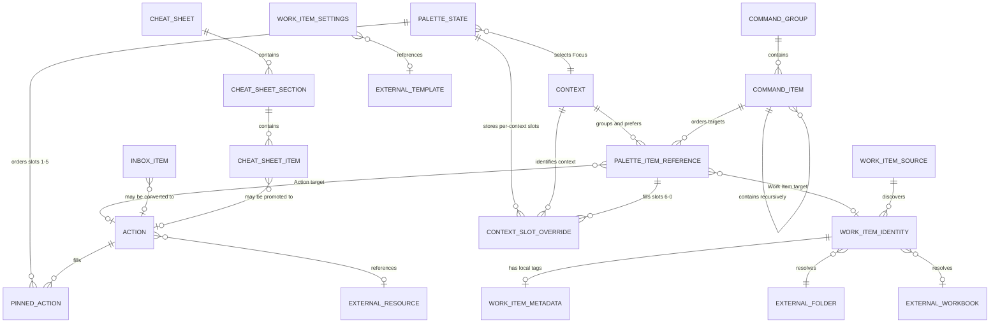

# Context Palette data model

This document describes the concepts and relationships implemented by Context
Palette. It is a logical model rather than a proposal to replace the current
JSON files with a database. Runtime structure and module ownership remain in
[Architecture](ARCHITECTURE.md); backup and restore implications are developed
in [Backup and restore plan](BACKUP_RESTORE_PLAN.md).

## Model boundary

The application works with three kinds of data:

1. **Persisted application data** — actions, contexts, Quick actions, palette
   choices, captured Inbox items, Work Item configuration, and cheat sheets.
2. **Runtime projections** — combined Built-in/My configuration lists, resolved
   Focus slots, the mixed All-items discovery view, generated Quick-action
   menus, and the discovered Work Item index. These can be rebuilt from
   persisted data and the local environment.
3. **External resources** — files, folders, applications, URLs, Windows
   Credential Manager entries, Work Item folders/workbooks, and Excel
   templates. Context Palette stores references to these resources, not their
   contents.

That boundary is essential for backup: a configuration backup can preserve the
application's records and references, but it is not automatically a backup of
every referenced file or secret.

**All items**, **Actions**, and **Work Items** are projections, not new stored
entities or ownership boundaries. The mixed projection joins current Actions
and discovered Work Items through `PaletteItemReference`, then applies shared
Context/tag filters. It does not convert a Work Item into an Action or persist
the discovery rows.

## Concept map



The dotted conversion/promotion relationships are workflow history only. The
created Action does not retain a persisted foreign key to its source Inbox or
cheat-sheet item.

## Persisted entities

### Action

Identity: `Action.id`, unique case-insensitively across Built-in and My
configuration action files.

| Field | Meaning |
| --- | --- |
| `id`, `title` | Stable identity and visible name |
| `type`, `value` | Allow-listed behavior and its primary configured value |
| `state` | Permanent `Active` or `Archived` lifecycle |
| `arguments`, `working_directory` | Structured launch details where supported |
| `tags`, `description` | Search and explanation metadata |
| `quick_action_path` | Optional derived-menu path for Password, Folder, or Prompt actions |
| `context`, `contexts`, `technology`, `task` | Readable legacy metadata; context definitions now own canonical membership |

An Action can contain text, a URL, a credential target name, or a reference to
an external Windows resource. Credential secrets are never stored in the
Action.

### Context

Identity: `ContextDefinition.name`, unique case-insensitively across Built-in
and My configuration context files. `General` is implicit and is not stored as
a definition.

| Field | Meaning |
| --- | --- |
| `name`, `description` | Stable visible identity and purpose |
| `action_ids` | Canonical ordered membership of Actions in this context |
| `preferred_action_ids` | Up to five preferred Actions for slots 6–0 |
| `work_item_refs` | Stable personal Work Item membership by source and folder identity |
| `preferred_items` | Up to five ordered typed Action or Work Item references for mixed slots 6–0 |
| `technology`, `task` | Readable legacy classification metadata |

Context definitions own current membership. Built-in Contexts remain
Action-only; My configuration Contexts may group both entity types. Action-side
context fields remain readable only for compatibility and migration.

### Palette state

There is one machine-local `PaletteState` aggregate.

| Field | Meaning |
| --- | --- |
| `pinned_action_ids` | Up to five ordered Action references for slots 1–5 |
| `focus_context` | Current Context name, or implicit `General` |
| `context_slots` | Context-name to ordered Action-reference overrides for slots 6–0 |
| `context_item_slots` | Context-name to ordered typed Action/Work Item overrides for slots 6–0 |
| `context_membership_version` | Marker for the completed membership migration, not a general file schema version |

### Quick-action command surface

`CommandGroup.id` is unique case-insensitively across Built-in and My
configuration files. A `CommandItem.id` is unique within its complete group
tree. Items recurse to a maximum of three submenu levels.

Each Command Item owns an ordered list of `CommandTarget` values. A target is
exactly one of:

- an Action reference by stable `action_id`; or
- a Work Item reference by stable `source_id` plus `relative_folder`.

Legacy action-only fields and the initial single-Work-Item field remain
readable. Legacy `primary_action_id` values now preserve first-in-menu order;
they do not imply execution from the launcher. New mixed records use `targets`.
The legacy `rows` and `nested_menu` presentation values also remain readable,
but both project to menu launchers. Built-in groups may reference only
Built-in Actions; Work Item targets are permitted only in My configuration.
`CommandTarget` is a compatibility name for the shared immutable
`PaletteItemReference`; Quick-action groups themselves currently have no
Context visibility or grouping rule.

Password, Folder, and Prompt menus are different: they are runtime projections
generated from active Actions of matching types and their `quick_action_path`.
An empty path places the Action at the generated menu root; a non-empty path
creates only those branches. They are not additional persisted Command Groups.

### Work Items

`WorkItemSource.id` is the stable identity of one configured root. It stores a
visible name and an absolute machine-local folder path.

A discovered Work Item has the composite stable identity:

```text
(source_id, relative_folder)
```

Discovery derives its display metadata, folder path, and optional exact-name
workbook from the filesystem. Those derived rows are not persisted. Optional
personal tags are stored as `WorkItemMetadata`, keyed by the same composite
identity. `WorkItemCreationSettings` stores one absolute external template
path.

Unavailable sources or Work Items are soft failures. Stable references and
metadata remain configured so they can recover when the source returns.

### Inbox

`InboxItem.id` identifies captured local text. An item stores title, content,
source, creation timestamp, state, and a suggested context. Inbox content is
potentially sensitive. Conversion creates a separate permanent Action and
changes Inbox state, but no persistent Action-to-Inbox provenance link exists.

### Cheat sheets

A `CheatSheet` contains ordered sections and items. Sheets are reviewed,
Git-tracked knowledge records. An item can be promoted to a new personal
Action, but the resulting Action is independent.

## Reference and integrity rules

| Reference | Policy |
| --- | --- |
| Context membership/preference → Action | Hard; the Action must exist |
| Personal Context membership/preference → Work Item | Soft; retained while its source/item is unavailable |
| Palette pin → Action | Hard; pins 1–5 remain Action-only |
| Palette Context slot → Action or Work Item | Action is hard; Work Item is soft |
| Palette Focus/context-slot key → Context | Canonicalized case-insensitively; unknown historical slot keys are currently preserved |
| Quick-action Action target → Action | Hard; the Action must exist |
| Built-in Context/Quick action → personal Action or Work Item | Forbidden |
| Quick-action Work Item target → Work Item source/item | Soft; it remains configured while unavailable |
| Work Item metadata → source/item | Soft; retained across disconnection or temporary disappearance |
| Action → file/folder/app/URL/credential target | External reference; availability is checked according to Action type and execution boundary |
| Work Item settings → Excel template | External machine-local reference |

Actions and Contexts form a practical reference cycle: Contexts own Action
membership, while Action views are projected back through those Contexts.
Personal Contexts additionally own soft Work Item references.
Consequently, restore must validate a complete staged snapshot rather than
attempt to prove safety one file at a time.

## Storage ownership and backup classification

`src/context_palette/data_catalog.py` is the executable source for this table.
Required means that absence is not valid for the current loader. Schema `1` is
a logical loader/adapter contract in the catalog; it is not a new JSON field
and does not change any stored format.

| Storage or constrained pattern | Stable asset ID | Ownership | Required | Sensitivity | Backup policy | Logical schema |
| --- | --- | --- | --- | --- | --- | --- |
| `data/actions.json` | `built-in-actions` | Built-in/shared | Required | Configuration | Complete-configuration addition | 1 |
| `data/contexts.json` | `built-in-contexts` | Built-in/shared | Required | Configuration | Complete-configuration addition | 1 |
| `data/command_surface.json` | `built-in-command-surface` | Built-in/shared | Optional | Configuration | Complete-configuration addition | 1 |
| `data/cheatsheets/*.json` | `built-in-cheat-sheets` | Built-in/shared | Optional | Configuration | Complete-configuration addition | 1 |
| `data/local_actions.json` | `personal-actions` | Personal/local | Optional | Configuration | Core configuration | 1 |
| `data/local_contexts.json` | `personal-contexts` | Personal/local | Optional | Configuration | Core configuration | 1 |
| `data/local_command_surface.json` | `personal-command-surface` | Personal/local | Optional | Configuration | Core configuration | 1 |
| `data/palette.json` | `palette-state` | Machine-local | Optional | Configuration | Core configuration | 1 |
| `data/local_work_item_sources.json` | `work-item-sources` | Machine-local | Optional | Private paths | Core configuration | 1 |
| `data/local_work_item_metadata.json` | `work-item-metadata` | Personal/local | Optional | Configuration | Core configuration | 1 |
| `data/local_work_item_settings.json` | `work-item-settings` | Machine-local | Optional | Private paths | Core configuration | 1 |
| `data/inbox.json` | `inbox` | Captured content | Optional | Captured content | Complete-configuration addition; explicit privacy notice and exclusion choice required | 1 |
| `data/local_text_action_source.txt` | `managed-text-action-source` | Captured content | Optional | Captured content | Optional managed content | None |
| `data/context-palette.log*` | `diagnostic-logs` | Derived/runtime | Optional | Diagnostics | Excluded | None |
| `data/restore-journal.json` | `restore-journal` | Derived/runtime | Optional | Private runtime data | Excluded | None |
| `data/*.bak` | `recovery-backups` | Derived/runtime | Optional | Private runtime data | Excluded | None |
| `data/*.tmp` | `temporary-data-files` | Derived/runtime | Optional | Private runtime data | Excluded | None |
| `.venv` | `python-environment` | Derived/runtime | Optional | Private runtime data | Excluded | None |
| `.venv-*` | `preserved-python-environments` | Derived/runtime | Optional | Private runtime data | Excluded | None |

Only the direct cheat-sheet JSON pattern is an included multi-file pattern; it
does not recurse. Uncatalogued files, caches, source/Git metadata, and external
Action targets, Work Item folders/workbooks, templates, and credential secrets
are not eligible payloads. The catalog does not scan or represent those
external resources.

## Runtime projections

The launcher builds and keeps last-known-good versions of:

- the combined Built-in and My configuration Action list;
- the combined Context list and context-owned Action/Work Item membership projection;
- the combined persisted command surface plus generated action-bound menus;
- resolved pins, Focus slots, filters, and visible rows;
- an immutable Work Item index refreshed from configured sources.

These projections should not be serialized into a backup. After restore, they
must be rebuilt from the restored persisted model and current environment.

## Aggregate snapshot and validation semantics

`src/context_palette/configuration_snapshot.py` is the executable aggregate
model for the structured assets above. It loads each asset independently through
its existing domain loader so a malformed file does not suppress unrelated
state or counts. Its snapshot retains Built-in and personal Actions, Contexts,
and command surfaces separately; stored Archived Actions remain present, while
the combined executable Action projection contains Active Actions only. Ordered
collections are tuples and dictionary-like data is exposed read-only, including
a defensive copy of palette Context slots.

Structured issues carry a stable code, catalog asset ID, severity, category,
privacy-safe summary, and optional stable subject IDs. Context membership,
preferences, pins, Context slots, and Quick-action Action targets are hard
references to Active Actions. Built-in-to-personal Action dependencies and
Built-in Work Item targets are errors. Missing Work Item source relationships,
noncanonical or historical palette Context names, and machine-local portability
dependencies are warnings. A failed defining asset causes dependent validation
to report an explicit skip instead of a misleading cascade.

The service loads Work Item sources, metadata, and creation settings but does
not scan their roots or require folders, workbooks, templates, or other external
resources to be available. Portability warnings retain catalog and stable-record
provenance while diagnostic summaries omit raw paths and private content.
Environment-placeholder paths, URLs, and registered protocols are not treated
as local filesystem dependencies. Optional managed text is represented only by
presence; its content and all excluded runtime assets remain unread.

## Backup archive model

`src/context_palette/backup.py` implements complete-configuration backup format
version 1. Payload selection uses the catalog as its only allow-list. Core and
Complete-configuration assets are selected, missing optional assets are
omitted, Inbox may be explicitly excluded, and managed text is selected only by
an explicit option. Excluded assets, unknown files, nested cheat-sheet content,
source/Git files, and all external resources remain outside the archive.

Each `BackupManifestEntry` identifies one exact staged file by catalog asset ID,
normalized POSIX path below `payload/`, applicable logical schema version, byte
size, and SHA-256 digest. `BackupManifest` adds only format/data-model versions,
an injected UTC creation time, complete-configuration scope, and deterministic
entry order. Machine paths and private values remain inside their owning payload
files and are never copied into manifest metadata or diagnostic summaries.

The backup service holds the application mutation gate while taking a bounded
catalog inventory, staging exact bytes, repeating SHA-256-backed fingerprints,
validating the staged `ConfigurationSnapshot`, and atomically publishing a
deterministic ZIP. The staged snapshot is a temporary filesystem-backed
`AppDataPaths`; restore can reuse the same domain inventory and reference rules.
The archive is sensitive and unencrypted. It is a configuration recovery input,
not a backup of external targets, Work Item content, templates, or credentials.

## Restore transaction model

`src/context_palette/restore.py` implements strict inspection and recoverable
replacement for backup format version 1. It never trusts ZIP paths or calls
archive extraction APIs. Manifest and ZIP entries must correspond exactly and
pass catalog membership, Windows destination-name, type, compression, count,
size, CRC, and SHA-256 checks. The conservative staged overlay replaces only
manifest-listed files and preserves every existing optional catalogued file
omitted by the archive, including unmatched cheat sheets. Unknown live files
remain untouched; omission never means deletion in format version 1.

The immutable restore plan contains operational fingerprints, catalog-relative
files to replace/create/preserve, Built-in impact, sensitive categories,
compatibility state, and the aggregate snapshot's privacy-safe warnings. It
contains no payload values and retains no staging tree. Commit requires a
matching explicit confirmation plus separate Built-in acknowledgement when
applicable, then repeats bounded inspection and validation under the process
mutation gate.

Before replacement, restore publishes an independent sensitive recovery archive
outside the application root and writes `data/restore-journal.json` atomically.
The recovery archive records exact bytes for every existing backup-eligible
catalogued file and fixed-file absence; the journal records only transaction,
catalog path, existence, size, per-file hash, and aggregate pre-restore state
hash metadata. The recovery archive is read back and both artifacts are durable
before the first live write. Rollback restores prior bytes or removes only
transaction-created files, and verifies the aggregate prior-state identity.
`main.py` first defers to an already-running launcher, then completes an
unfinished rollback before migrations or configuration loading. Backup and
standalone cleanup refuse an unresolved journal. The journal,
recovery-adjacent temporary files, logs, and `.bak` files remain excluded from
ordinary backup payloads.

## Current model limitations relevant to backup and restore

- Phases 1 through 4 centralize application-data paths, classification,
  complete structured loading, aggregate reference validation, and deterministic
  bounded backup publication, and add hostile inspection plus recoverable
  aggregate replacement.
- Logical schema versions now exist in the catalog, but current JSON files do
  not persist one general schema-version field.
- Backup and restore both validate catalog-controlled staged trees through the
  same aggregate snapshot service. Restore format version 1 has no tombstones,
  so omitted optional assets are preserved rather than deleted.
- The mutation gate is process-local. Phase 4 deliberately exposes no mutating
  restore CLI because it cannot exclude a separately running launcher.
- Absolute paths and external references can be valid on the source computer
  but unavailable after transfer to another computer.
- The current adjacent `.bak` files each represent a different last write and
  are never assembled into one restore point; the recovery archive is the only
  aggregate rollback source.

These limitations motivate the foundations and phased plan in
[Backup and restore plan](BACKUP_RESTORE_PLAN.md).
